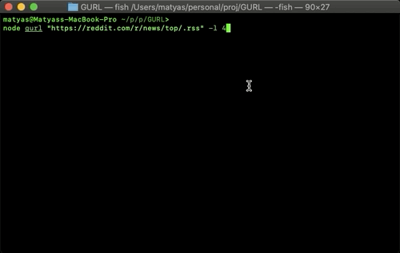

[](https://travis-ci.com/sajtosM/GURL) 

# G.U.R.L.
> The Grand Unified Read List

## What is the G.U.R.L.?
G.U.R.L. is a tool to parse RSS feeds into emails.

## Installation

Install the libs

```sh
npm install
```

Or if you prefer using Yarn:
```sh
yarn install
```
### Setup the email client

Run with `--init` to set up the configuration.

```sh
node index.js --init
```

The `config.json` should look like this:
```json
{
    "target": "email_where_you_want_to_send_the@newsletter.com",
    "auth": {
        "user": "emailadress_that_you_want_to_use_to_send_the@newsletter.com",
        "pass": "password"
    }
}
```

## Usage

# 

```sh
node index.js "https://reddit.com/r/news/.rss"
```

If you don't want to send a mail `--noMail`:

```sh
node index.js "https://reddit.com/r/funny/.rss" --noMail
```

If you want to limit the number of the Rss entries:

```sh
node index.js "https://reddit.com/r/wallstreetbets/.rss" 5
```

